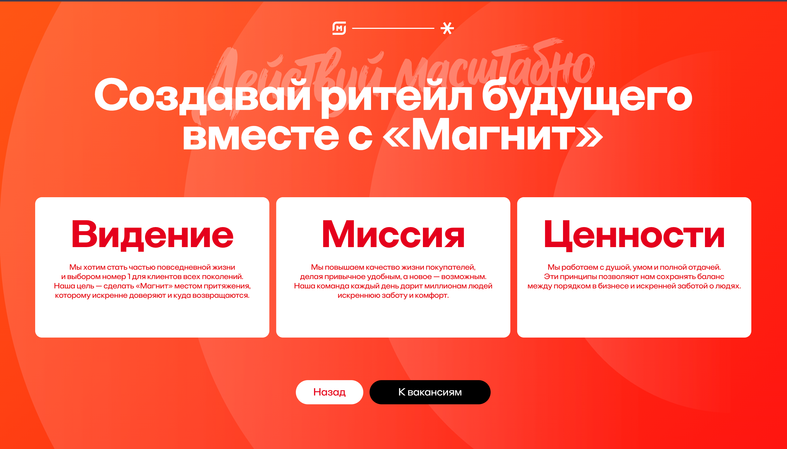
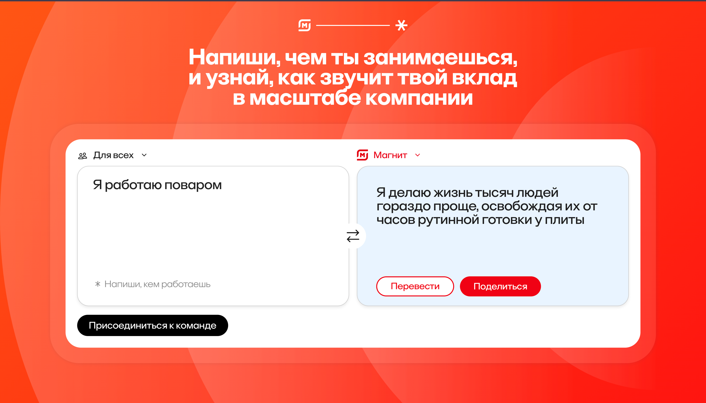
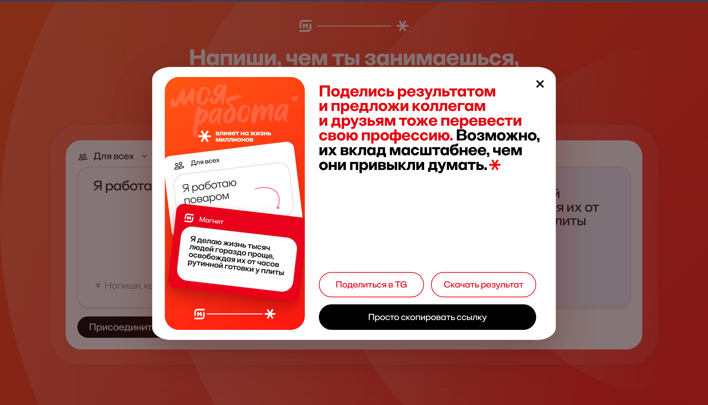

# Magnit Impact Translator

An interactive employer-brand experience that helps Magnit employees see the wider impact of their everyday work. Users describe what they do in their own words, and the application turns that description into a short, inspiring statement about how their role improves life for millions of people.

The experience combines a responsive branded interface with AI-generated copy, downloadable result cards, Telegram sharing, product analytics, and a protected administration dashboard.

## Screenshots

<table>
  <tr>
    <td width="50%"></td>
    <td width="50%"></td>
  </tr>
  <tr>
    <td align="center"><strong>Campaign landing page</strong></td>
    <td align="center"><strong>Vision, mission, and values</strong></td>
  </tr>
  <tr>
    <td width="50%"></td>
    <td width="50%"></td>
  </tr>
  <tr>
    <td align="center"><strong>AI-powered impact translator</strong></td>
    <td align="center"><strong>Result preview and sharing</strong></td>
  </tr>
</table>

## Features

- AI-assisted transformation of job descriptions into concise impact statements
- Responsive campaign flow for desktop and mobile devices
- Asynchronous translation jobs backed by Apache Kafka
- Downloadable branded result cards generated in the browser
- Telegram sharing and shareable links
- Product-event tracking and SQLite persistence
- Telegram-authenticated analytics dashboard for administrators
- Server-side OpenAI integration—the API key is never exposed to the browser
- Docker-based local and production deployment with Nginx and Traefik

## Tech Stack

| Layer | Technologies |
| --- | --- |
| Web application | React 19, Vite 8 |
| Admin dashboard | React, Chakra UI |
| API and workers | Node.js 22, native HTTP server |
| Queue and storage | Apache Kafka, SQLite (`node:sqlite`) |
| AI | OpenAI Responses API |
| Infrastructure | Docker Compose, Nginx, Traefik, Let's Encrypt |

## Architecture

The browser sends a job description to the Node.js API. After validating the input, the API stores a translation job and publishes it to Kafka. A worker processes the job through the OpenAI Responses API, stores the result in SQLite, and makes it available to the frontend through a polling endpoint. The frontend then animates the generated statement and lets the user download or share a branded result.

```text
Browser → Nginx → Node.js API → Kafka → Translation worker → OpenAI
                         ↘              ↙
                              SQLite
```

See [the architecture guide](./docs/ARCHITECTURE.md) for C4 diagrams and the complete request flow.

## Getting Started

### Prerequisites

- Docker with Docker Compose
- An OpenAI API key

### Configuration

Create a local environment file:

```bash
cp .env.example .env
```

Set your server-side OpenAI credentials in `.env`:

```dotenv
OPENAI_API_KEY=your-key
OPENAI_MODEL=gpt-5.4-mini
API_UPSTREAM=backend:3001
```

`API_UPSTREAM` is the private backend address used by the frontend proxy. Keep `backend:3001` for the standard Docker Compose setup.

### Run the Application

Build and start all services:

```bash
docker compose up --build -d
```

Once the containers are healthy, open:

- Web application: `http://localhost:8080`
- API health check: `http://localhost:8080/api/health`
- Admin application: `http://localhost:18081`

The admin application requires Telegram Web App authentication. Configure `TELEGRAM_BOT_TOKEN` and `ADMIN_TELEGRAM_IDS` before using it outside the included mock-data workflow.

To follow the service logs:

```bash
docker compose logs -f
```

To stop the stack:

```bash
docker compose down
```

## Deployment

The default Compose stack includes Traefik routing and automatic TLS certificates. Configure `DOMAIN`, `ADMIN_DOMAIN`, and `LETSENCRYPT_EMAIL` in `.env` for a public deployment.

To run only the API infrastructure on a separate server:

```bash
docker compose -f deploy/backend-compose.yml up --build -d
```

In a split deployment, set `API_UPSTREAM` to the backend's private address reachable by the frontend server. The browser continues to access the API through the same-origin `/api/` proxy.

## Documentation

- [REST API reference](./docs/API.md)
- [OpenAPI 3.1 specification](./docs/openapi.yaml)
- [Architecture and security](./docs/ARCHITECTURE.md)
