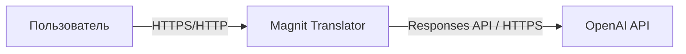
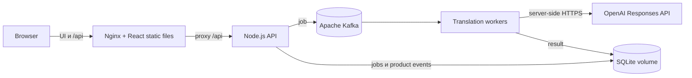
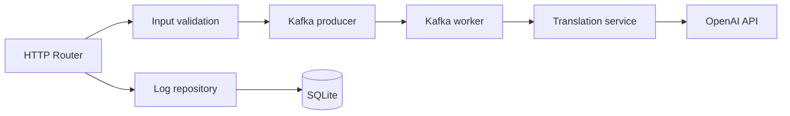
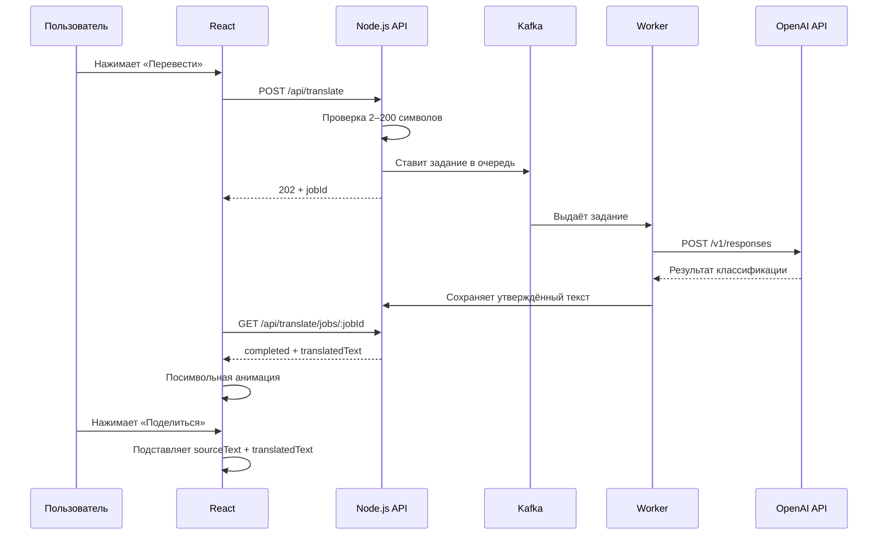

# C4-архитектура Magnit Translator

## Стек

| Слой | Технологии |
|---|---|
| Web UI | React, Vite |
| API | Node.js, встроенный `http` |
| Данные | SQLite (`node:sqlite`), Apache Kafka |
| AI | OpenAI Responses API |
| Доставка | Nginx, Docker Compose |

## C4 Level 1 — System Context

Пользователь описывает работу, получает формулировку вклада и делится результатом. OpenAI доступен только backend-сервису.

В production frontend и backend могут находиться на разных серверах. Frontend принимает браузерные запросы `/api/*` на том же HTTPS-домене и проксирует их к Node.js API через `API_UPSTREAM`. Сетевой порт backend разрешён только для frontend-сервера; браузер и OpenAI-ключ к нему прямого доступа не имеют.

## C4 Level 2 — Containers

## C4 Level 3 — Backend Components

## Поток перевода

## Безопасность

- `OPENAI_API_KEY` находится только в `.env`/Docker secret backend-сервиса.
- `.env` исключён из репозитория.
- Backend ограничивает вход до 200, а ответ до 100 символов.
- Kafka хранит очередь 24 часа; восемь разделов позволяют обрабатывать до восьми переводов параллельно.
- Неуспешные обращения к OpenAI повторяются до пяти раз с увеличивающейся задержкой.
- В продуктовые логи передаются длины и статусы, а не API-ключ.
- Для production нужны rate limit, корпоративная авторизация административного endpoint и HTTPS.
